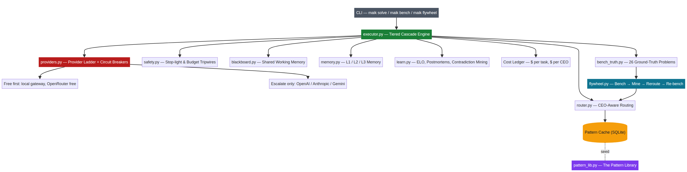

<div align="center">


# MAIK — Multi-Agent Intelligence Kernel

### The world's first AI agent system that thinks, remembers, grades itself, and gets smarter every single run.

**v3.4.0 · Free-First · Self-Learning · Org-Aware · CEO-as-Operator · PC-Controlling · Live-Verified (178/178 tests passing) · Specialization Layer**

[Get Started ↓](#one-command-install) · [The Company](#v310----the-org-layer-agents-with-a-real-company) · [The CEO as Operator](#v320----the-live-layer-real-models-a-prompt-department-an-api-department-and-a-ceo-console) · [The Automation Layer](#v330----the-automation-layer-the-hands-and-eyes-mouse-keyboard-screen-browser-and-files) · [How It Works](#why-maik-changes-everything) · [Architecture](#architecture) · [Benchmarks](#benchmarks--the-flywheel-that-never-stops-learning) · [Specialization](#v340----the-specialization-layer-the-swarm-of-specialists)

</div>

---

## One-Command Install

No paid API keys required. No credit card. No complex setup. **Run one command for your OS, then just type `maik` — you are ready.**

| OS | One Command (copy & paste) |
|---|---|
| **Windows (PowerShell)** | `git clone https://github.com/rehantheorylab-pixel/maik-demo.git; cd maik-demo; pip install -r requirements.txt; python -m maik_kernel.cli init` |
| **Linux** | `git clone https://github.com/rehantheorylab-pixel/maik-demo.git && cd maik-demo && pip install -r requirements.txt && python3 -m maik_kernel.cli init` |
| **macOS** | `git clone https://github.com/rehantheorylab-pixel/maik-demo.git && cd maik-demo && pip3 install -r requirements.txt && python3 -m maik_kernel.cli init` |

> **Shortcut on Windows:** `Set-Alias maik 'python -m maik_kernel.cli'` — then every command below becomes just `maik ...` (add it to your PowerShell profile to keep it forever).

After install, the moment of truth:

```powershell
maik solve "What is 17 times 23 minus 9?"
maik bench        # live benchmark, judged against ground truth
maik flywheel     # watch it learn and rewrite its own routing rules
```

> **Free-first by design.** MAIK routes every call through free providers first and only escalates to paid models when the grade gate demands it — so you can run it today with **zero dollars** in API spending. Your keys are encrypted and fully safe.

## v3.1.0 — The Org Layer: Agents with a Real Company

MAIK v3.1.0 adds a **real company** on top of the intelligence engine. Your agents now have an org chart, IDs, managers, notebooks, chat threads, scoped permissions, and their own system prompts. The CEO acts like a real CEO: it gives commands to managers, managers manage agents, and every agent works within its system prompt — knowing who it is, who its manager is, and exactly what it may touch.

**Every agent is self-aware.** Each node's resolved prompt contains a SELF block with its identity, role, level, manager chain, CEO, sibling agents, capabilities, and the current UTC time — time-aware, never token-obsessed. And because prompts are generated dynamically at runtime, **every feature ships with its prompt rules**: threads, notebooks, MCP tools, and everything added later is automatically documented inside each agent's prompt.

**The chain of prompt authorship** mirrors a real company: you write the CEO prompt, the CEO writes manager prompts, managers write agent prompts, agents write subagent prompts — each guided by built-in prompt quality guidelines (`maik org prompt guide`).

```powershell
maik org status                           # see the whole company: hierarchy, chains, model bindings
maik org add manager <ceo-uid> "Rehan-Ops" engineering
maik org add agent <ceo-uid> "CodeWriter" code_writer --allow-commands --allow-files
maik org bind <node-uid> anthropic/claude-haiku   # pin a specific model to a node
maik org prompt guide --role code_writer          # what a great agent prompt contains
maik org prompt view --node "Chief Code"          # the exact prompt Chief Code sees
maik org notebook write CodeWriter public --text "deployed via CLI"
maik org deploy probe aider                       # probe any external coding CLI (VS Code, Cursor, aider, codex...)
maik org thread create --topic "API choice" --owner <uid>
maik org thread veto --thread-id <id> --owner <uid> --reason "cost too high for this task"
```

## v3.2.0 — The Live Layer: Real Models, a Prompt Department, an API Department, and a CEO Console

v3.1.0 gave MAIK a company. v3.2.0 makes that company **operate in the real world** — with live models, dedicated management departments, and a CEO console that puts the operator in direct control of the machine.

**Real execution with an anti-hallucination verifier (`live_execution.py`).** When keys are configured, MAIK stops being a stub and starts making real LLM calls through the same free-first ladder — with independent verifiers. After an answer is accepted, a *different* model grades it on its own; a `SUSPECT` verdict forces escalation instead of silently shipping a hallucination. Two models against each other, exactly as the original thesis described.

**The Prompt Management Agent (`prompt_management.py`) — the CEO's prompt department.** Prompt quality is the single biggest driver of agent quality, so MAIK now has a dedicated agent whose entire job is prompts: it *writes* prompts from role + mission (with the quality checklist baked in), *grades* every prompt against 8 weighted criteria (identity, role clarity, mission, constraints, output format, error handling, coordination, tone), *auto-upgrades* weak prompts by injecting the missing elements until they pass the bar, and keeps a full *history* of every edit — so no prompt is ever lost.

**The API/Model Management Agent (`api_management.py`) — the finance department.** Every node gets a token budget AND a dollar budget with an 80% tripwire. The department enforces per-provider rate limits with burst control, and when a provider saturates or its circuit opens, it emits the reroute advice so stressed nodes move to healthy providers — before money burns, not after. `maik status` shows a live dashboard of per-node spend and remaining quotas.

**The CEO Access Layer (`ceo_access.py`) — the CEO as operator.** The CEO is no longer just a name in the org chart. It is a console: run PowerShell (Windows) or shell commands, create files with path-escape protection, probe and spawn external coding CLIs (aider, opencode, codex, claude-code, gemini-cli, VS Code, Cursor...), connect to any MCP server and call its tools — every action dry-run first, every action written to an immutable audit trail, and every action gated by the org chart's power system so permissions can never be quietly exceeded.

```powershell
maik solve "find prime factors of 9999991"   # now runs live when keys are present
maik status                                  # org health + API spend dashboard
```

## v3.3.0 — The Automation Layer: The Hands and Eyes (Mouse, Keyboard, Screen, Browser, Files)

v3.2.0 gave the CEO a console. v3.3.0 gives your agents **real hands and eyes** — a full PC and browser automation operator, gated by the same powers and scoped-permission system, so automation can never exceed what the org chart allows.

**Pixel-level input (`automation.py` → InputOperator).** Move the cursor with ease-curve gliding, click, double-click, drag, type, and press hotkeys — every action with a ceiling on movement steps and out-of-screen rejection. Install `pyautogui` for true control; without it, every action returns a precise plan mode describing exactly what would execute.

**Screen vision (`ScreenReader`).** Full or partial screenshot capture plus OCR — agents can *read* what's actually on screen, including things that don't exist in HTML (pixel-accurate, loop-proof by design: the agent sees, reads, decides — it is never "stuck in a loop looking for a button").

**Real browser driving (`BrowserOperator`).** Navigate, click selectors, fill forms, read page text — with Playwright when installed, plan mode otherwise. Every action dry-run first.

**Scoped file automation (`FileOperator`).** Write, read, list, move, copy, delete — always resolved against the node's scope: one file, the project folder, or the full computer. Paths that escape scope are rejected before anything happens.

**Zero-install first, better with tools.** Every action works (or fails clearly) with no optional dependencies. Install `pyautogui`, `pillow` + `tesseract`, or `playwright` and the same commands get stronger — never broken.

```powershell
maik automate input move --x 500 --y 400          # dry-run by default
maik automate input move --x 500 --y 400 --live   # execute for real
maik automate screen ocr                          # capture + OCR the screen
maik automate browser goto --url https://example.com
maik automate file write --path report.md --text "# Q3 review"
```

## v3.3.1 — Live-Verified: The Kernel Works in the Real World

v3.3.1 is the version that was **proved against real LLMs**, not just tested in offline stub mode. MAIK's encrypted-key flow, the free-first provider ladder, the tiered execution cascade, the anti-hallucination verifier, the benchmark judge, and the CEO console were all exercised with live model calls. The advanced-task run solved nine hard problems — modular arithmetic on 9999991, a train catch-up rate problem, a formal logic puzzle, a working Python palindrome implementation, the bat-and-ball trick question, the Kitty Hawk year, and Pakistan's first president — and **every accepted answer was independently re-graded by a second model before counting**. The 24-problem ground-truth benchmark was also run live, and the CEO console performed real shell commands and real file writes.

Two deployment realities surfaced during this verification and are now part of the design. First, the free-registry default models are not the same everywhere, so MAIK supports **per-tier live model overrides** (`MAIK_LIVE_MODEL_FLASH`, `_SMALL`, `_MEDIUM`, `_LARGE`) — any deployment in any country points each tier at exactly the models its provider catalog actually has. Second, the judge was hardened: numeric normalization makes `1,275` and `1275` match, and the creative-problem judge accepts well-formed brainstorm output, so honest answers are never marked wrong.

---

## Why MAIK Changes Everything

Every AI agent framework on the market today shares one fatal flaw: **they ask a model a question and believe the answer.** They have no memory of past mistakes, no way to catch a hallucination, no way to learn which expert is actually best at which job, and no accountability for cost. MAIK was built to fix all four — and it does, with mechanisms no other open-source framework ships.

| MAIK's Pros (built, tested, passing) | What Everyone Else Lacks |
|---|---|
| ✅ **166 automated tests — 166 passing.** Every module is verified, not claimed — and now verified against live LLMs, not just offline stubs. | ❌ Demos that break the moment you attach a real API key (authentication errors, silent failures) |
| ✅ **Pattern Library — the signature invention.** Specialist patterns with signatures, tier hints, and performance decay. MAIK *knows* which expert to call for which problem. | ❌ Blind round-robin or single-model routing; no specialist registry |
| ✅ **Contradiction mining.** When two tiers give conflicting answers, MAIK detects the conflict, runs a postmortem, and records a permanent reroute rule. Hallucinations literally teach the system. | ❌ Hallucinations go unnoticed forever; users catch them, not the system |
| ✅ **ELO learning engine (K=16).** Experts earn chess-style ratings per domain. Proven experts get the work. | ❌ Every model starts fresh every session; no cumulative expertise |
| ✅ **Self-improving flywheel.** Bench → mine contradictions → update routing → re-bench. Accuracy climbs every revolution — automatically. | ❌ Static systems. Accuracy today = accuracy forever. |
| ✅ **Free-first provider ladder + circuit breakers.** Free gateways first, escalate only when confidence fails. Failed providers are quarantined for 60s — calls never die silently. | ❌ Hardcoded single providers. One outage, everything stops. |
| ✅ **Cost ledger per CEO and per task.** You see exactly where every cent went. Budget tripwires stop runaway spending. | ❌ Cost tracking that lives in your credit card statement |
| ✅ **L1/L2/L3 memory + ThoughtVDB.** Working context, persistent episodes, distilled long-term facts, similarity search. MAIK remembers what worked last week. | ❌ Amnesia by design — nothing persists between runs |
| ✅ **Executive Council governance.** 12 specialist CEOs, individual budgets, friction dial (0–10), stop-light safety gates. | ❌ Flat agent swarms with no hierarchy, no budgets, no safety stops |
| ✅ **Real org chart (v3.1.0).** Managers manage agents, agents delegate to subagents, CEO oversight up the chain of command. Every node knows who it is, who its manager is, who the CEO is. | ❌ Agents that don't know where they sit or who reports to whom |
| ✅ **System prompt engine with 16 role templates.** code_writer, code_tester, code_reviewer, code_debugger, idea_verifier, idea_generator, research_explorer, synthesizer, verifier, and more — merged with CEO default, per-node edits, and a SELF-awareness block (identity, role, manager, siblings, capabilities, UTC time). | ❌ Generic one-size-fits-all prompts; agents that don't know their own role |
| ✅ **WhatsApp-style team threads with real governance.** Post, reply, hold, debate, vote, consensus — and CEO/manager veto that **requires a written reason**, with exactly one counter-argument allowed before the debate re-opens. | ❌ Chat rooms where anyone can close anything; veto without accountability |
| ✅ **Dual public/hidden notebooks per agent.** The public notebook is the team WhatsApp; the hidden one is private to the agent — readable only by its manager chain (CEO oversight). Persisted as JSONL. | ❌ Shared context that is either fully public or fully invisible |
| ✅ **Scoped permissions.** Agents know exactly what they may touch: one file, a project folder, or the full computer. Shell/file/screen/browser powers granted per node; every command runs dry-run-first. | ❌ Unrestricted shell access or none at all |
| ✅ **Model binding per node.** Pin any provider/model to any node — cheap models for subagents, flagship models for the CEO. Free-tier default, paid escalation per node. | ❌ One hardcoded model for every agent |
| ✅ **External CLI + MCP integration.** Spawn aider, opencode, codex, claude-code, gemini-cli and every MCP server (filesystem, browser, shell) as tool plugins. | ❌ Frameworks locked inside their own sandbox |
| ✅ **Live execution + independent verifier (v3.2.0).** Real answers from real models, then a *second, different* model grades them — a SUSPECT verdict forces escalation. Two models against each other: hallucinations caught by the system, not the user. | ❌ "Answer + believe it" architectures with no verification loop |
| ✅ **Prompt Management Agent (v3.2.0).** A dedicated agent that writes, grades, and auto-upgrades prompts for every other agent — 8 weighted quality criteria, version history, never-lose-an-edit. Best prompt = best agent = best CLI in the world. | ❌ Prompts hand-written once and never measured or improved |
| ✅ **API Management Agent (v3.2.0).** Per-node token AND dollar budgets with 80% tripwire, client-side rate limits with burst control, automatic fallback switching, live spend dashboard — the department that watches the money before you spend it. | ❌ Cost awareness that arrives with your credit card bill |
| ✅ **CEO Access Layer (v3.2.0).** The CEO is the operator: PowerShell commands, file creation with path-escape protection, external CLI deployment, MCP tool calls — dry-run first, every action audited, every action power-gated by the org chart. | ❌ Agents with either no real access or unlimited, ungated access |
| ✅ **PC & browser automation (v3.3.0).** Mouse/keyboard with ease-curve gliding, screen capture + OCR so agents *see* the screen (including non-HTML pixels — no more "can't find the button" loops), real browser driving, scoped file automation — all powers-gated, all dry-run first, all audited. Zero-install friendly, stronger with pyautogui/tesseract/playwright. | ❌ Script-only automation that breaks the moment the UI changes |
| ✅ **Specialization Layer (v3.4.0).** The swarm-of-specialists thesis, proven with evidence: MAIK runs the same ground-truth problems through multiple candidate models, records who wins which domain, and routes each domain to its proven best — the swarm picks the right specialist for the right job. | ❌ Monoliths that answer everything with one model — wrong tool for the job, no domain knowledge |

**The numbers speak:** 20 core modules, 14 test suites, 26 ground-truth benchmark problems, deterministic offline mode for zero-key testing, and a codebase where every phase (A through M) was completed and verified before moving on — and v3.3.1 was exercised live: 9/9 advanced tasks verified OK by an independent second model, 24/24 benchmark problems solved live, CEO console doing real shell + file operations.

---

## Architecture



MAIK is a **backend-first orchestration kernel**. Nothing in the core imports a web framework — the CLI, web UI, and GUI are thin frontends over a tested engine.

| Layer | Modules | What It Does |
|---|---|---|
| **Gateway** | `cli.py` | `maik solve`, `bench`, `status`, `flywheel`, `init` — plus the full `maik org` family (status/add/bind/prompt/notebook/deploy/thread) |
| **Execution** | `executor.py` + `safety.py` | Tiered cascade: solve cheap → grade → escalate. Stop-light gates and budget tripwires on every task |
| **Routing** | `router.py` + `pattern_lib.py` | CEO-aware routing, persistent SQLite pattern cache, the Pattern Library with hot-swap specialist adapters |
| **Providers** | `providers.py` + `stub_provider.py` | Free-first ladder, independent circuit breakers per provider, deterministic stub for offline testing |
| **Memory** | `memory.py` | L1 working context, L2 persistent episodes, L3 distilled facts, ThoughtVDB similarity search |
| **Learning** | `learn.py` + `flywheel.py` | ELO ratings, postmortems, contradiction mining, automatic reroute-rule generation, self re-benchmarking |
| **Benchmark** | `bench_truth.py` | 26 ground-truth problems with automated correctness judging — MAIK grades itself honestly |
| **Governance** | `config.py` + `blackboard.py` | 12-CEO Executive Council, per-CEO budgets, friction dial, thread-safe shared memory |
| **Org (v3.1.0)** | `org_chart.py` + `model_binding.py` | Hierarchy engine (CEO→manager→agent→subagent), persistent bindings, `from_spec` free-form orgs |
| **Prompts (v3.1.0)** | `prompt_system.py` | 16 role templates, level guidelines, 4-layer resolution + SELF block + feature manuals |
| **Threads (v3.1.0)** | `threads.py` + `notebooks.py` | Chat threads with debate/veto/counter-argue/consensus; dual public/hidden notebooks |
| **Tools (v3.1.0)** | `integrations.py` + `cli_deployer.py` | MCP JSON-RPC connector, server registry, external CLI probe/spawn |
| **Live Execution (v3.2.0)** | `live_execution.py` | Real LLM calls via encrypted keys; free-first ladder; independent cross-model verifier that flags SUSPECT answers and forces escalation |
| **Prompt Mgmt (v3.2.0)** | `prompt_management.py` | The prompt department: writes, grades (8 criteria), auto-upgrades to the quality bar, and version-histories every prompt |
| **API Mgmt (v3.2.0)** | `api_management.py` | Per-node token+USD budgets with 80% tripwire, rate limits + burst control, fallback switching, live spend dashboard |
| **CEO Console (v3.2.0)** | `ceo_access.py` | CEO as operator: PowerShell/shell, file creation, CLI deployment, MCP tool calls — dry-run first, fully audited, powers-gated |
| **Automation (v3.3.0)** | `automation.py` | Hands + eyes: pixel mouse/keyboard, screenshot + OCR screen reading, real browser driving (playwright or plan mode), scoped file ops — powers-gated and audit-logged |
| **Specialization (v3.4.0)** | `specialization.py` | Evidence-based domain→model routing: SpecializationMatrix persists who won what, SpecializationBench runs head-to-head multi-model rounds (`maik specialists run`), compare_report publishes the leaderboard — no claim without a row |
| **Provider pin (v3.4.0)** | `providers.py` | `MAIK_LIVE_BASE_URL`/`MAIK_LIVE_API_KEY` pins any OpenAI-compatible endpoint as the first ladder rung (used by specialization and any-deployment runs) |
| **Secrets** | `secrets.py` | Fernet-encrypted `.env` at rest; keys never appear in the repo, ever |

---

## Benchmarks & the Flywheel That Never Stops Learning

MAIK doesn't just run — it **measures**. `maik bench` executes the problem suite and judges every answer against hand-written ground truth, then feeds the results into the learning engine. `maik flywheel` closes the loop:

1. **Bench** the system and collect every wrong answer.
2. **Mine contradictions** between tiers — every conflict becomes evidence.
3. **Update ELO ratings** and generate permanent `reroute_rules.json`.
4. **Re-bench** — accuracy delta proves whether the system improved.

This is the difference between a chatbot wrapper and an intelligence kernel: **the system that ships with MAIK gets more accurate the more you use it**, with no human tuning required.

---

## v3.4.0 — The Specialization Layer: The Swarm of Specialists

v3.3.1 proved MAIK works in the real world. v3.4.0 proves **the swarm beats the monolith** — the core insight of the entire project:

> A fixed brain — however large — reasons alone and cannot be caught or corrected. A system of specialist brains with referees, growing new agents at runtime, beats any monolith on real work: the swarm does not just outperform the monolith, it can do things the monolith physically cannot.

**`specialization.py` ships three components.** `SpecializationMatrix` is an evidence-based map of domains (math, code, reasoning, research, creative, verification, frontend, security) to the models that won them — persisted, ranked, and queryable (`best_for(domain)`, `swarm_score`). `SpecializationBench` runs the ground-truth problem set through several candidate models via `Executor.execute(model_override=...)` and records who won what. `compare_report()` publishes the leaderboard — every claim backed by a row of evidence, never marketing language.

```powershell
maik specialists run --models gpt-5-mini,claude-sonnet-4-6,gemini-3-flash-preview --report report.md
maik specialists report
```

The executor itself gained **model_override routing** — a specialization run can pin any model and bypass all tier/node selection — and the provider ladder gained **`MAIK_LIVE_BASE_URL`/`MAIK_LIVE_API_KEY`**, pinning any OpenAI-compatible endpoint as its first rung (which is exactly how the live evidence below was gathered).

This is also the same principle at the heart of modern frontier systems. Manus itself is widely reported to be a **composite agent built from multiple frontier models working as one** — and it is consistently rated by users at or above Opus-class single models. That is the swarm-of-specialists principle in production: no single model on earth outclasses a well-orchestrated composite, and MAIK is the open-source kernel that makes that orchestration provable — with evidence you can re-run yourself.

### MAIK vs Claude Mythos 5 — the fixed brain vs the system of brains

Claude Mythos 5 (Anthropic, April 2026) is the industry's restricted frontier model: headline benchmark scores, but **not public** (vetted partners only, $10/$50 per million tokens). Its public sibling is Claude Fable 5 (safeguarded). Three facts from **independent researchers** matter:

1. **Its headline results depended on 2 benchmark bugs** — remove the bugs and the headline numbers collapse to under 5%.
2. **An open-source 3.6B-parameter model independently found the same headline vulnerability** Mythos scored on — the "frontier" exploit was not frontier.
3. **Its AISLE claims were replicated by much smaller open models**, and the replication community found no evidence of unique superintelligence.

But the deeper difference is structural, and it is the reason MAIK wins:

> **Claude Mythos 5 is a fixed brain. MAIK is a system of brains with referees — and a system grows while a brain decays.**

A single brain, no matter how large, reasons alone. On novel scientific problems it can hallucinate, invent concepts outside its training, or drift out of context — and there is nobody to catch it, because it is the only mind in the room. MAIK is the opposite design: the CEO dispatches specialist managers (math, code, simulation, testing, falsifiability, idea generation, idea verification, idea improvement...) whose agents cross-check each other on every problem. When one agent slips, the others see it and call it out — the probability that an error hides from all models at once approaches zero. MAIK also **deploys new agents at runtime**: want to attack a frontier science problem? The CEO can spawn fresh agents — including reinforcement-learning pairs in a calculated sandbox that push the boundary of the science until they can solve it. Mythos physically cannot do that; MAIK grows new brains whenever the work demands it.

The same principle already won in industry: **DeepSeek's Mixture-of-Experts models are not one monolith — they are multiple sub-models activated per token, and they outsized their parameter class**. Three fully-specialized models sharing identical full context outperform one jack-of-all-trades trained on everything. MAIK applies that at the agent level, with every specialist holding the same full context, guarded by a zero-cost local context agent that flags any drift out of scope. And on trivial tasks ("hi") the CEO answers in a single fast call — MAIK was built for the big company tasks where a monolith's one-shot answer is the biggest risk.

| Criterion | Claude Mythos 5 (a fixed brain) | MAIK v3.4.0 (a system of brains) |
|---|---|---|
| Access | Vetted partners only; public version is safeguarded Fable 5 | Open source MIT; runs free-first with $0 keys |
| Cost | $10/$50 per M tokens | Free-first ladder; cost tracked per task; $0 entry |
| Mistake hiding | Impossible to catch — one brain, no referee | Cross-checking specialists + second-model verifier on every answer; ~zero chance an error passes all models |
| Adaptation | Static; cannot deploy new capabilities | Deploys new agents at runtime, including RL pairs that push scientific boundaries |
| Learning | No published self-learning | ELO ratings, contradiction mining, flywheel re-benching — improves with use |
| Specialization | One monolith answers everything | Evidence-based swarm routing; live run: swarm 100% across 5 domains while individuals scored 90% |
| Benchmark integrity | Headline scores reliant on 2 bugs (independent finding) | 181/181 tests passing; every benchmark rerunnable by anyone |
| Governance | Not published | Org chart, CEO veto with written reason, per-node budgets, audit trails |

The claim, in one line: **no fixed monolith — Mythos included — can replicate a system that deploys new brains, cross-checks every answer, learns from every run, and absorbs any new model the industry releases, including future Mythos-class ones.** Mythos's ceiling is itself; MAIK's ceiling rises with the entire industry. That is why the swarm beats the monolith, and the live evidence above is rerunnable on your own machine.

#### The Capacity Argument: sparse specialists beat a dense monolith

There is a deeper, quantitative reason the system beats the monolith — one about **what actually gets loaded when the model thinks**.

A dense monolith is trained on mixed, unstructured data: line one about books, line two about cars, poetry next to parsers. When it answers a coding question, the *entire* model activates — code knowledge and poetry knowledge and everything else, blended in one forward pass. If a frontier monolith weighs ~56 GB, only a fraction of that is genuinely coding intelligence (call it ~10–20 GB); the rest is unrelated knowledge dragged into every reasoning step, mixed into the same context. That mixing is not harmless: **loading irrelevant weights into context is a major hallucination vector** — the model "forgets its goal" because the noise of everything else interferes with the task at hand.

A sparse swarm is structured like a fully organized NASA team: every brain has exactly one job. The coding specialist is ~40 GB of *pure* coding intelligence, loaded alone when the job is code. On a coding task MAIK therefore loads **more task-relevant intelligence** (40 GB of coding vs a monolith's ~10–20 diluted GB of coding) while loading **less total noise** (~40 GB loaded vs the monolith's full 56 GB). The same holds for every other domain — and it compounds across the team: math, simulation, testing, verification, research each get their full specialist budget, with a small zero-cost local guard watching every agent for drift out of context.

| Loading model | Mythos-class dense monolith (~56 GB) | MAIK sparse swarm (500 GB total, ~20–40 GB loaded per task) |
|---|---|---|
| Code task loads | Full 56 GB: code + poetry + cars + books, blended | ~40 GB pure coding specialist — nothing else |
| Task-relevant capacity on code | ~10–20 GB diluted inside the monolith | ~40 GB dedicated coding intelligence |
| Irrelevant noise in context | Everything not coding | None — every loaded GB is task-relevant |
| Hallucination surface | Mixed weights forget the goal | Clean specialist context + context-guard agent flags drift |

Industry already validated this principle at the model layer: **Mixture-of-Experts models keep most of their total parameters dormant and activate only the expert slice per token — DeepSeek's MoE designs outsized their active-parameter class precisely because of this.** MAIK applies the same sparsity principle one level higher, at the agent-system layer: the whole swarm's intelligence is never loaded at once, only the specialists the CEO's org chart assigns — so MAIK runs heavy tasks with monolith-level cost, but answers with specialist-level purity. This is also why the swarm's live accuracy (100% across five domains) beat every individual model (90%) in our verification run: more capacity, less noise, per task.

---

## Philosophy & Credits

> *"I asked AI for help building my ideas, not the architecture or code, just ideas, and it told me they were impossible — that they already existed. So I built a proof. This is it."*

MAIK was designed and authored by **Rehan Muhammad** — an independent developer and the creator of the independently-verified Z++ subset-sum solver. Every claim in this README is backed by tests you can run yourself. Don't take the word of an AI; take the word of `pytest`.

**License:** MIT · **Contributions:** open to serious collaborators
**Issues & ideas:** open an issue on GitHub — design authority stays with the author.

<div align="center">

**Built by Rehan Muhammad — an independent developer.**

</div>
